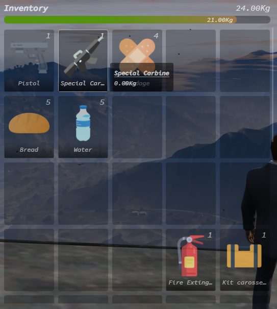

# eInventoryLite

Elclark Inventory Lite. Is an simple ESX Inventory with drag and drop and splittable items to organize your items and weapons

## Screenshot



## Features

- Drag & Drop
- Easy To Use
- Simple Design
- Splittable items
- Mappable Keybind
- Cache First (Better performance even with slow connection)

## Keybind

- (Default) `F2` To <b>Open Inventory</b>
- `Left Click` To <b>Use Item</b>
- `Right Click` To open Context Menu
- `Drag & Drop` To <b>Move Item</b> (Hold `Shift` To <b>Move one Items</b> only)
- `ESC / F2` To <b>Close Inventory<b>

## Requirements

- [esx-legacy](https://github.com/esx-framework/esx-legacy)
- [mysql-async](https://github.com/brouznouf/fivem-mysql-async/releases/tag/3.3.2)

## Download & Installation

1. Clone or [Download](https://github.com/ElclarkKuhu/eInventoryLite/releases) the project and add it to your resorces directory
2. Add this to your `server.cfg`:
    ```
    ensure eInventoryLite
    ```
3. Import `eInventoryLite.sql` in your database